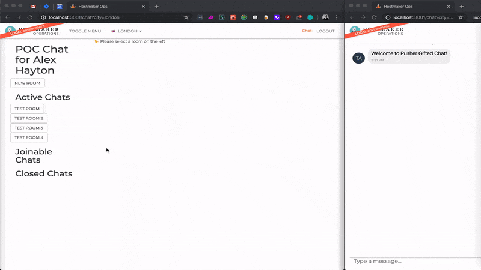

# Pusher Chatkit Gifted Chat

[](https://david-dm.org/hostmakerco/pusher-chatkit-gifted-chat)
[](https://www.npmjs.com/package/pusher-chatkit-gifted-chat)
[](https://github.com/hostmakerco/pusher-chatkit-gifted-chat/issues)
[](https://github.com/hostmakerco/pusher-chatkit-gifted-chat/pulls)
[](https://github.com/hostmakerco/pusher-chatkit-gifted-chat/stargazers)

A helpful wrapper for [Pusher Chatkit](https://pusher.com/chatkit) to make it super easy to use with `react-native-gifted-chat` or `react-web-gifted-chat`

 - [Installation](#installation)
  - [Getting started](#getting-started)
  - [Usage](#usage)
    - [Connect to pusher](#connect-to-pusher)
    - [Get the list of rooms](#get-the-list-of-rooms)
    - [Set the current room](#set-the-current-room)
    - [Render messages for the current room](#render-messages-for-the-current-room)

## Demo



## Installation

`npm install pusher-chatkit-gifted-chat`

or

`yarn add pusher-chatkit-gifted-chat`

The project expects you to have `react` and `lodash` installed but has no other dependencies.

## Getting started

Follow the [instructions from Pusher](https://pusher.com/docs/chatkit/getting_started/react#creating-a-chatkit-instance) to set up your Chatkit instance and get your `instanceLocator` and either use the development-mode `TokenProvider` or your own backend to provide auth tokens.

## Usage

### Connect to pusher

```jsx
// In production you should override this with your own token provider callback.
const tokenProvider = new TokenProvider({
  url: 'https://us1.pusherplatform.io/services/chatkit_token_provider/v1/XXXXX/token',
});

const instanceLocator = 'v1:us1:XXXXX';

export const ChatWindowWithoutRedux = ({ user }: Props) => (
    <ChatkitGiftedProvider
      userId={user.id.toString()}
      tokenProvider={tokenProvider}
      instanceLocator={instanceLocator}
    >
      🧙 Your Components Go Here!
    </ChatkitGiftedProvider>
);
```

### Get the list of rooms

The framework subscribes to updates for you so you will get updates to participants/unreadCount/joining/leaving rooms in real time.

```jsx
import { ActiveRoomsContext } from 'pusher-chatkit-gifted-chat';

export const RoomListWithoutRedux = ({ userId, userName }: Props) => {
  const { loading, activeRooms, joinableRooms, createRoom } = React.useContext(ActiveRoomsContext);
  return (
    loading ?
      <Loader loaded={!loading}/> :
        <>
          <h2>Active Rooms</h2>
          {activeRooms.map(room => (
            <div key={room.id}>
              {room.name}
            </div>
          ))}
        </>
  )
}
```

### Set the current room

Only one room can be active at a time. The framework subscribes to events for you so that you will get real-time updates for messages arriving, participants joining/leaving etc.

```jsx
import { ChatRoomContext } from 'pusher-chatkit-gifted-chat';

const JoinRoom = ({ room: { id, name, unreadCount } }: RoomProps) => {
  const { setCurrentRoomId } = React.useContext(ChatRoomContext);
  return <Button onClick={() => setCurrentRoomId(id)}>
}
```

### Render messages for the current room

```jsx
import { ChatRoomContext } from 'pusher-chatkit-gifted-chat';

export const ChatFrameWithoutRedux = ({ user }: Props) => {
  const { loading, currentRoomId, messages, onSend, onInputTextChanged, footer } = React.useContext(ChatRoomContext);

  if (!currentRoomId) {
    return (
      <div>
        👈 Please select a room
      </div>
    )
  }

  console.log('Rendering chat', messages)

  return (
    loading ?
      <Loader loaded={!loading}/> :
      <GiftedChat
        messages={messages}
        user={user}
        onSend={onSend}
        onInputTextChanged={onInputTextChanged}
        renderFooter={() => <span>{footer}</span>}
        showUserAvatar
      />
  );
};
```
